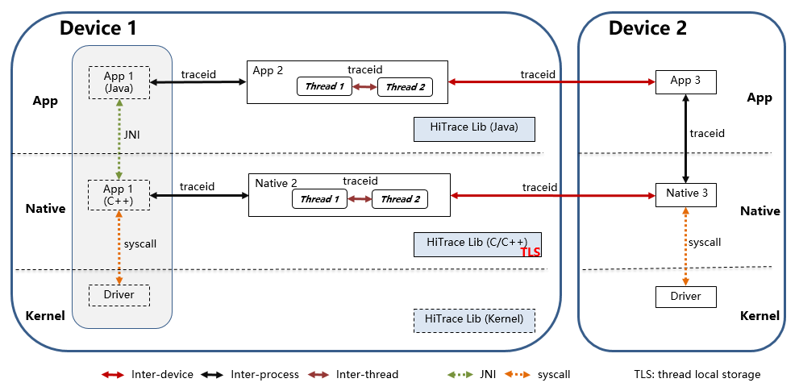

# HiTrace<a name="EN-US_TOPIC_0000001078081802"></a>

-   [Overview](#section11660541593)
-   [Architecture](#section16334748141112)
-   [Directory Structure](#section161941989596)
-   [Constraints](#section119744591305)
-   [Usage](#section1312121216216)
    -   [Available APIs](#section1551164914237)
    -   [Usage Guidelines](#section129654513264)

-   [Repositories Involved](#section1371113476307)

## Overview<a name="section11660541593"></a>

HiTrace provides APIs to implement call chain tracing throughout a service process. With HiTrace, you can quickly obtain the run log for the call chain of a specified service process and locate faults in cross-device, cross-process, or cross-thread communications.

## Architecture<a name="section16334748141112"></a>

**Figure  1**  Architecture of HiTrace <a name="fig4460722185514"></a>  




HiTrace is the lightweight implementation based on the distributed call chain of cloud computing. HiTrace implements call chain tracing as follows:

-   Transfers  **traceid**  in cross-device, cross-process, and cross-thread communications.
-   Stores  **traceid**  in the thread local storage \(TLS\) at the Native layer of the process.
-   Automatically adds  **traceid**  to existing events and run logs.

## Directory Structure<a name="section161941989596"></a>

```
/base/hiviewdfx/hitrace
├── frameworks           # Framework code
│   ├── java            # HiTrace Java implementation code
│   ├── jni             # HiTrace JNI implementation code
│   └── native          # HiTrace Native implementation code
└── interfaces           # APIs
   ├── java              # Java APIs
   │   ├── innerkits    # JAR packages opened to internal subsystems
   │   └── kits         # JAR packages opened to applications
   └── native            # C/C++ APIs
       └── innerkits     # Header files opened to internal subsystems
```

## Constraints<a name="section119744591305"></a>

HiTrace is already supported by the IPC and EventHandler communication mechanisms. If you are using a custom communication mechanism, adaptation is required to use HiTrace.

## Usage<a name="section1312121216216"></a>

### Available APIs<a name="section1551164914237"></a>

Major APIs of HiTrace

<a name="table1764215412123"></a>
<table><tbody><tr id="row1370464111219"><td class="cellrowborder" valign="top" width="8.98%"><p id="p1670474115124"><a name="p1670474115124"></a><a name="p1670474115124"></a><strong id="b13126192811515"><a name="b13126192811515"></a><a name="b13126192811515"></a>Class</strong></p>
</td>
<td class="cellrowborder" valign="top" width="27.47%"><p id="p167041041191214"><a name="p167041041191214"></a><a name="p167041041191214"></a><strong id="b93135237153"><a name="b93135237153"></a><a name="b93135237153"></a>API</strong></p>
</td>
<td class="cellrowborder" valign="top" width="63.55%"><p id="p970484112122"><a name="p970484112122"></a><a name="p970484112122"></a><strong id="b4370358151913"><a name="b4370358151913"></a><a name="b4370358151913"></a>Description</strong></p>
</td>
</tr>
<tr id="row970417418126"><td class="cellrowborder" rowspan="2" valign="top" width="8.98%"><p id="p16704184111220"><a name="p16704184111220"></a><a name="p16704184111220"></a>HiTrace</p>
</td>
<td class="cellrowborder" valign="top" width="27.47%"><p id="p1270444181220"><a name="p1270444181220"></a><a name="p1270444181220"></a>HiTraceId begin(String name, int flags)</p>
</td>
<td class="cellrowborder" valign="top" width="63.55%"><p id="p20704144114123"><a name="p20704144114123"></a><a name="p20704144114123"></a>Starts call chain tracing, generates a <strong id="b52151451154412"><a name="b52151451154412"></a><a name="b52151451154412"></a>HiTraceId</strong> object, and sets it in the TLS of the calling thread.</p>
<p id="p1270494114128"><a name="p1270494114128"></a><a name="p1270494114128"></a>Input parameters:</p>
<p id="p370434151220"><a name="p370434151220"></a><a name="p370434151220"></a><strong id="b1586330121717"><a name="b1586330121717"></a><a name="b1586330121717"></a>name</strong>: Indicates the name of the service process.</p>
<p id="p9704104181212"><a name="p9704104181212"></a><a name="p9704104181212"></a><strong id="b10973143151713"><a name="b10973143151713"></a><a name="b10973143151713"></a>flags</strong>: Indicates call chain flags, which can be used in combination. </p>
<p id="p187046416125"><a name="p187046416125"></a><a name="p187046416125"></a><strong id="b3332144316176"><a name="b3332144316176"></a><a name="b3332144316176"></a>HITRACE_FLAG_INCLUDE_ASYNC</strong>: Traces both synchronous and asynchronous calls. By default, only synchronous calls are traced.</p>
<p id="p12704104121212"><a name="p12704104121212"></a><a name="p12704104121212"></a><strong id="b17906163911715"><a name="b17906163911715"></a><a name="b17906163911715"></a>HITRACE_FLAG_DONOT_CREATE_SPAN</strong>: Do note create a span. By default, a span is created.</p>
<p id="p17704104171210"><a name="p17704104171210"></a><a name="p17704104171210"></a><strong id="b16819174510193"><a name="b16819174510193"></a><a name="b16819174510193"></a>HITRACE_FLAG_TP_INFO</strong>: Outputs the tracepoint information. By default, the tracepoint information is not output.</p>
<p id="p97041241181215"><a name="p97041241181215"></a><a name="p97041241181215"></a><strong id="b15542450201714"><a name="b15542450201714"></a><a name="b15542450201714"></a>HITRACE_FLAG_NO_BE_INFO</strong>: Do not output the start and end information. By default, the information is output.</p>
<p id="p47041241151211"><a name="p47041241151211"></a><a name="p47041241151211"></a><strong id="b68075771720"><a name="b68075771720"></a><a name="b68075771720"></a>HITRACE_FLAG_DONOT_ENABLE_LOG</strong>: Do not associate logs for output. By default, logs are associated for output.</p>
<p id="p147041741141215"><a name="p147041741141215"></a><a name="p147041741141215"></a><strong id="b11871181131812"><a name="b11871181131812"></a><a name="b11871181131812"></a>HITRACE_FLAG_FAULT_TRIGGER</strong>: Triggers call chain tracing by fault. By default, call chain tracing is triggered normally.</p>
<p id="p2704164181214"><a name="p2704164181214"></a><a name="p2704164181214"></a><strong id="b59161113131816"><a name="b59161113131816"></a><a name="b59161113131816"></a>HITRACE_FLAG_D2D_TP_INFO</strong>: Outputs inter-device tracepoint information. By default, the tracepoint information is not output.</p>
<p id="p17704941121210"><a name="p17704941121210"></a><a name="p17704941121210"></a><strong id="b20659623501"><a name="b20659623501"></a><a name="b20659623501"></a>HITRACE_FLAG_DEFAULT</strong>: Indicates the default flag.</p>
<p id="p17704174141216"><a name="p17704174141216"></a><a name="p17704174141216"></a>Output parameters: none</p>
<p id="p07045418125"><a name="p07045418125"></a><a name="p07045418125"></a>Return value: Returns a valid <strong id="b149053347524"><a name="b149053347524"></a><a name="b149053347524"></a>HiTraceId</strong> object if call chain tracing is triggered successfully; returns an invalid object otherwise.</p>
<p id="p17041941151217"><a name="p17041941151217"></a><a name="p17041941151217"></a>Note: In nested tracing mode, an invalid object will be returned if tracing is started at the nested layer.</p>
</td>
</tr>
<tr id="row18704194111211"><td class="cellrowborder" valign="top"><p id="p11704641131213"><a name="p11704641131213"></a><a name="p11704641131213"></a>void end(HiTraceId id)</p>
</td>
<td class="cellrowborder" valign="top"><p id="p20704144141212"><a name="p20704144141212"></a><a name="p20704144141212"></a>Stops call chain tracing based on the <strong id="b109681242310"><a name="b109681242310"></a><a name="b109681242310"></a>HiTraceId</strong> object returned by the <strong id="b171995411436"><a name="b171995411436"></a><a name="b171995411436"></a>Begin</strong> API, and clears the <strong id="b87181818247"><a name="b87181818247"></a><a name="b87181818247"></a>HiTraceId</strong> object in the TLS of the calling thread.</p>
<p id="p7704174181215"><a name="p7704174181215"></a><a name="p7704174181215"></a>Input parameters:</p>
<p id="p14704134111216"><a name="p14704134111216"></a><a name="p14704134111216"></a><strong id="b15542231182"><a name="b15542231182"></a><a name="b15542231182"></a>id</strong>: Indicates the <strong id="b046517501252"><a name="b046517501252"></a><a name="b046517501252"></a>HiTraceId</strong> object.</p>
<p id="p15704104111215"><a name="p15704104111215"></a><a name="p15704104111215"></a>Output parameters: none</p>
<p id="p16704741181213"><a name="p16704741181213"></a><a name="p16704741181213"></a>Return value: none</p>
</td>
</tr>
</tbody>
</table>

### Usage Guidelines<a name="section129654513264"></a>

\(1\) Enable call chain tracing for the service process.

Import the  **HiTrace**  and  **HiTraceId**  classes.

```
import ohos.hiviewdfx.HiTrace;
import ohos.hiviewdfx.HiTraceId;
```

Add the code to start or stop call chain tracing.

```
HiTraceId traceId = HiTrace.begin("MyServiceFlow", HiTrace.HITRACE_FLAG_DEFAULT);
... (service process for call chain tracing)
HiTrace.end(traceId);
```

\(2\) Run the application.

\(3\) Use the hilog tool in the shell to filter logs of the service invoking process.

Filter logs based on the  **name**  parameter in the tracing task and find  **ChainId**.

hilog | grep "MyServiceFlow"

**Note**: The log format for traceid is as follows:

Time PID TID Level Domain/Tag: \[**ChainId**, SpanId, ParentSpanId\] Content

Filter the logs of the service invoking process based on  **ChainId**.

hilog | grep "ChainId"

## Repositories Involved<a name="section1371113476307"></a>

[Hivew](https://gitee.com/openharmony)

[HiDumper](https://gitee.com/openharmony)

